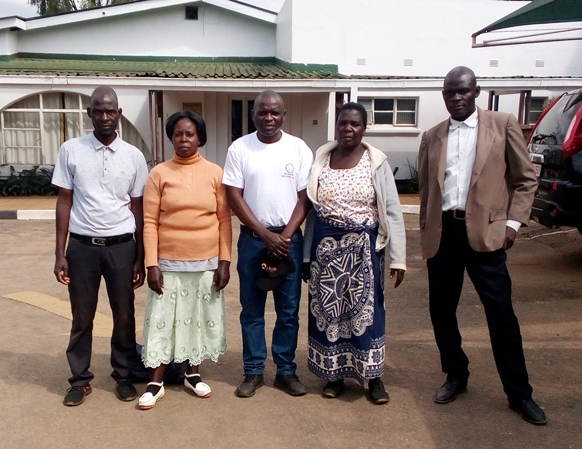
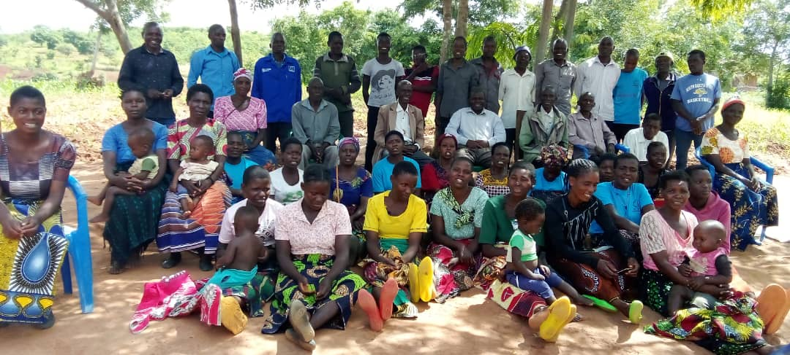
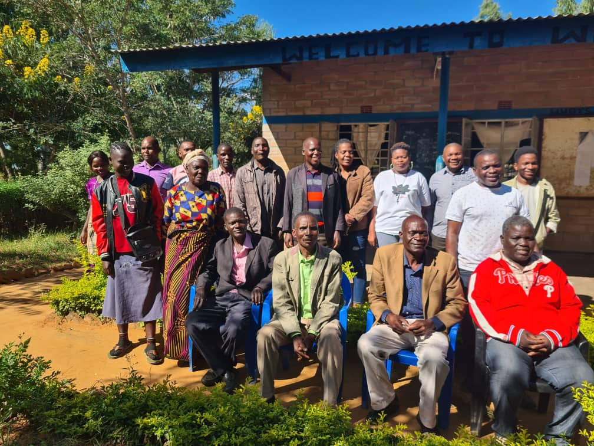
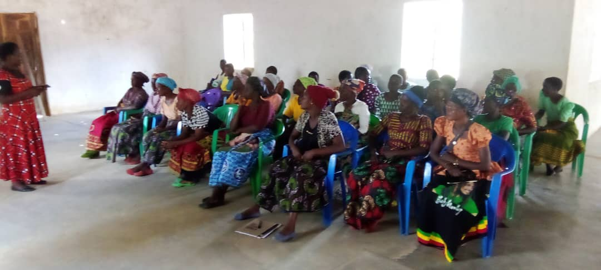
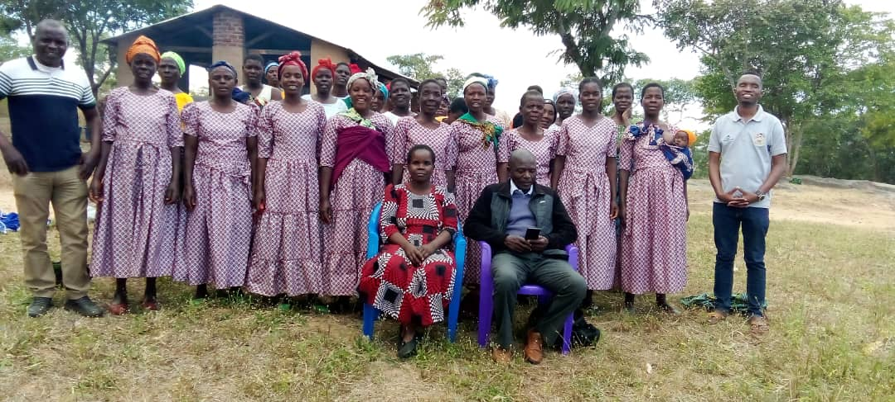
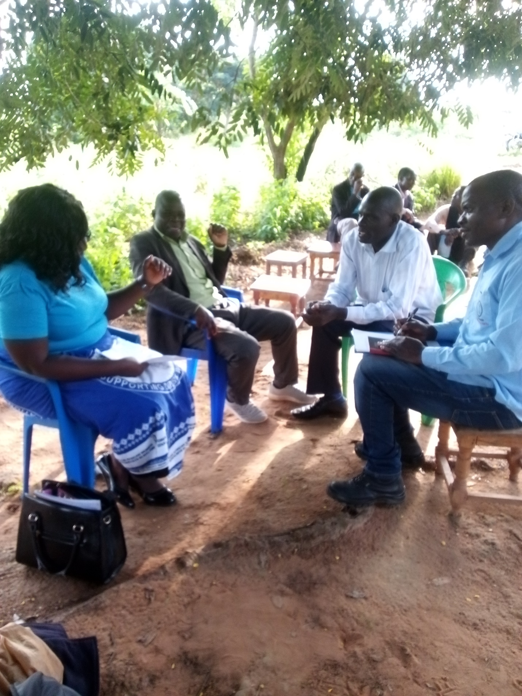
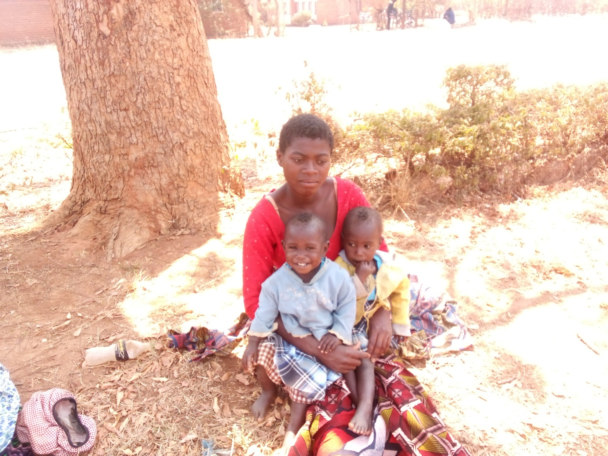
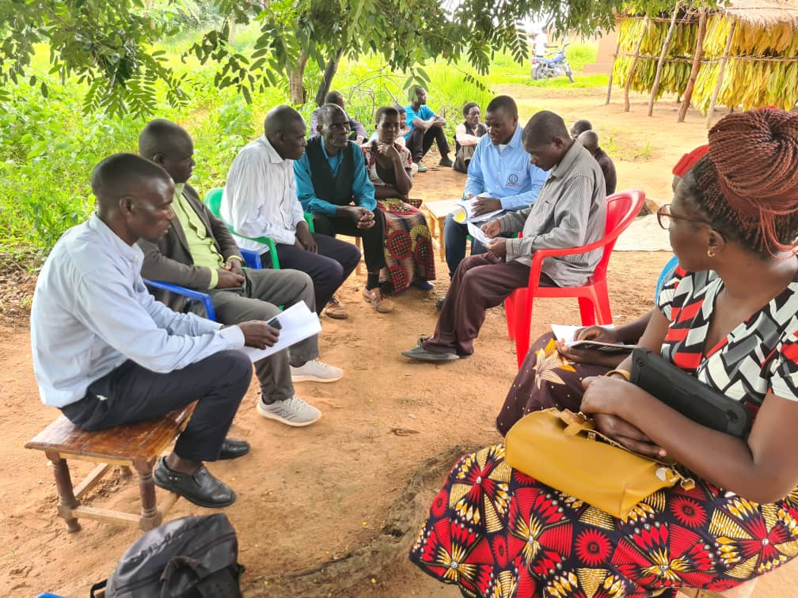
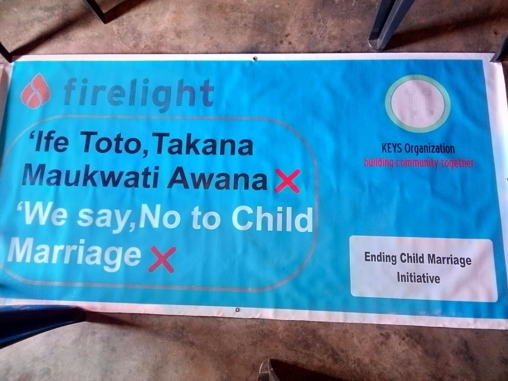
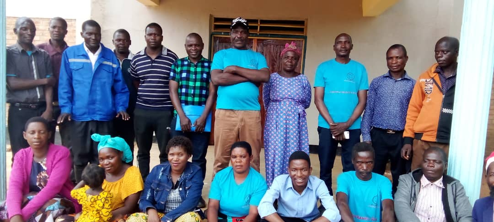

::: {.column-margin}

::: {.callout-important icon=false}
## Media Spotlight

[Times 360 Malawi](https://www.facebook.com/100069098034320/posts/1254138033566119/)  
[Zodiak Online](https://www.facebook.com/100064481388635/posts/pfbid097CheKLNHDkxrmsodA16mcjk9DHGYfCCoMTHxqaPm4q6uWHyY2jKyrv5yGm63nA3l)
:::

:::

## About the program

KEYS Organization engages against child marriage since many years and identified one of its members as Child Protection Worker. Currently, it is building an office to increase the visibility and accessibility of information on this topic. It raises awareness on this topic through the organization of advocacy and awareness meetings and workshops, which have already reached almost 2000 people. Moreover, it foiled potential and ended existing child marriages in over 20 cases. Elderly individuals caring for children are offered psycho-social counselling and essential items for everyday needs by the KEYS Organization and 14 persons were selected and trained as pre-school teachers. 

Learn more about the activities of KEYS Organization against child marriage in [this document](assets/KEYS-Presentation-Firelight Foundation Orientation-27May2024.pdf): 
{width=100% height=450}

In 2024, the [Firelight Foundation](https://www.firelightfoundation.org/) selected the KEYS Organization as grantee partner. Being a grantee, KEYS Organization will receive financial support and capacity building through the Firelight Foundation for the next four years, helping them in their fight against child marriage through their approach of [community-driven systems change (CDSC)](https://www.firelightfoundation.org/cdsc). 

::: {layout="[ 50 , 50 ]"}

::: {#column-text}
As a first or learning phase, KEYS Organization identifies the root causes for child marriage, identify key stakeholders to be involved and designing a methodology to collect information, compile the results of their research and their learnings. This includes capacity building events on how to write a proposal and budget. In the second or implementation phase, the developed strategies are put into practice to find and implement strategies to address the underlying issues that lead to the practice of child marriage. The community and the key stakeholders will be actively involved by KEYS Organization in all steps of this project. 
:::

::: {#column-image}
{fig-alt="The Executive Director of the KEYS Organization together with four other members are standing on a parking lot in front of a white wooden building with green roof tiles."}
:::

:::

## Addressing the root causes of child marriage is key to prevention

* **Community Awareness & Norms Change**: Conducted 4 awareness campaigns reaching 630 people with messages on ending child marriage.
* **Trained 75 families** in Village Savings and Loan (VSL) methodologies, empowering them to save and invest in their children’s basic needs. 
* **Linked three VSL members** to become Airtel Money agents, creating sustainable income opportunities. 
*	**Alternative income stream established**: KEYS rented four (4) hectares of land to grow legumes and maize for sale in 2024. Proceeds support future operations of our Ending Child Marriage (ECM) program.
* **Engaged and trained 2 Chiefs’ Councils (26 members)**: The district Social Welfare Office, Community Development office, and Police facilitated the training to ensure that child protection systems were owned and sustained by the community.

::: {layout-nrow=2}

{group="ECM-update"}

{group="ECM-update"}

{group="ECM-update"}

{group="ECM-update"}

:::

## Direct Intervention & Support for Survivors
Our program delivers tangible, life-changing results for vulnerable children.

::: {layout="[ 67 , 33 ]"}

::: {#column-text}

*	**23 child marriages nullified**, legally freeing children from harmful unions (10 through member financial support, 13 through Firelight Foundation grant funding). 
*	**Supported two cases and concluded one (1) court case** where perpetrator of child marriage was sentenced 10 years with hard labour.
*	**18 potential marriages disrupted**, preventing children from entering unions before reaching legal age. 
*	**Direct survivor support**: One survivor received startup capital for a small business. Another received essential educational materials. A survivor (mother of twins) was supported through legal processes to secure child support from the father. Highlighting **impact, prevention, and sustainability of ECM efforts**

:::

::: {#column-image}

{group="ECM-update"}

:::

:::

::: {layout-nrow=2}

{group="ECM-update"}

{group="ECM-update"}

{group="ECM-update"}

{group="ECM-update"}

:::
